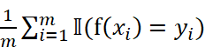
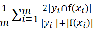
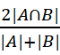

# 中文讽刺计算评测任务

讽刺，作为表达隐式情感的修辞手段，其特点在于字面语义与实际含义相悖。社交媒体时代，讽刺表达的广泛使用促使学术界和产业界加强了对讽刺文本的理解与识别研究。研究者正致力于研究讽刺的内在语言规律和认知逻辑，构建能模拟人类讽刺思维过程的认知语言模型，以增强人工智能对复杂情感的解读能力。然而，由于自然语言的多样性和复杂性，尤其是在互联网环境下的非正式表达，极大增加了讽刺文本自动检测的难度。如何有效解析中文讽刺文本的情感语义并结合多元知识进行准确建模分析，是当前自然语言处理领域亟待解决的难点问题之一。

本评测数据集采集了2020年10月至2021年5月期间的新浪微博数据，内容涉及政治、体育、娱乐、经济等领域，数据包含微博正文（上下文）及相关评论（目标语句）。我们选择了其中最具有争议性的微博主题，通过数据预处理、数据标注，质量监控等过程，构建了中文讽刺数据集。该数据集包含50个微博主题及其对应的相关评论，评论数据约3万条。对于每条评论数据，标注了是否为讽刺、情感极性、讽刺类别、讽刺的细粒度目标等标签。

## 1 子任务一：讽刺识别

### 1.1 任务介绍

讽刺识别任务是指，对于给定的文本，其目标在于判断文本是否包含嘲笑、轻蔑等讽刺的含义[1]。

子任务一，讽刺识别：对于给定的微博正文（上下文）和评论数据（目标语句），参赛模型需判断当前评论数据是否为讽刺语句。输出为2种标签：“1”表示该句子为讽刺语句，“0”表示该句子为非讽刺语句。

### 1.2 数据样例

数据样例为微博和相应的评论数据，微博包括微博标题和微博正文，可作为上下文，评论数据为目标语句。

微博标题：【老人#偷鸡蛋被拦猝死家属索赔38万被驳#】

微博正文：2020年6月13日下午，江苏南通67岁的谷某在超市购物时，在口袋里放了两个鸡蛋未结账便欲离开，被工作人员阻拦后猝死。家属起诉超市索赔38万余元。法院审理认为工作人员的行为属于自助行为，驳回家属请求。原告不服，认为超市未尽到安全保障义务和基本的救助义务上诉，法院二审维持原判。”

输入：公正的判决，下次超市再有这种情况，得提前问一下，你自尊心强吗？

输出：1

输入：标题偷鸡蛋本来就不对，还讹超市……这判决公平公正。

输出：0

### 1.3 评价指标

macro F1。

## 2 子任务二：讽刺类别识别

### 2.1 任务介绍

讽刺的类别识别任务是指，对于给定的讽刺文本，其目标在于判断讽刺文本属于哪个讽刺类别。

子任务二，讽刺类别识别：对于给定的微博正文（上下文）和评论数据（目标语句），参赛模型需判断当前评论数据属于哪个讽刺类别。输出为6种标签，“1”表示Sarcasm（嘲笑），“2”表示Irony（反语），“3”表示Satire（讽刺文学），“4”表示Understatement（轻描淡写），“5”表示Overstatement（夸大），“6”表示Rhetorical question（反问）。讽刺类别[2-3]说明如下：

1）Sarcasm，与事态相矛盾并持批评态度的评论，标注为1；

2）Irony，与事态相矛盾但没有明显批评态度的评论，标注为2；

3）Satire，看似支持但包含潜在分歧和嘲讽的评论，标注为3；

4）Understatement，降低或破坏事态重要性的评论，标注为4；

5）Overstatement，用明显夸张的措辞描述事态的评论，标注为5；

6）Rhetorical question，用反问语句引导读者推理出与实际情况明显相悖的含义的评论，标注为6。

### 2.2 数据样例

数据样例为微博和相应的评论数据，微博包括微博标题和微博正文，可作为上下文，评论数据为目标语句。

微博标题：【#一百多买包怀疑是假LV#掌柜承认是“高仿”】

微博正文：李先生在网上买了个包，花了128块钱。他说以为是LV的，收到包裹后，怀疑买到的是假货。店家倒是很坦诚，说本来就是高仿的，但从来没说卖的是LV。看到李先生的百万级路虎，记者有点好奇。

输入：卖家是倒了八辈子血霉摊上你这种大熊买家。

输出：1

输入：换个角度想啊，这种人多了以后就不会有山寨抄袭货了，原创才能崛起。

输出：2

输入：用128为自己买了个热搜，👍🏻。

输出：3

输入：一分钱一分货，100多还不如买路虎。

输出：4

输入：这位李先生笑死我了。

输出：5

输入：要不要脸，128你还想买正品？

输出：6

### 2.3 评价指标

macro F1。

## 3 子任务三：细粒度讽刺目标识别

### 3.1 任务介绍

细粒度讽刺目标识别任务是指，对于给定的文本，其目标在于识别评论语句中讽刺目标实体[4-5]。

子任务三，细粒度讽刺目标识别：对于给定的微博正文（上下文）和评论数据（目标语句），参赛模型需识别评论语句中讽刺目标实体。从目标语句中准确识别出一个或多个讽刺目标。

### 3.2 数据样例

数据样例为微博和相应的评论数据，微博包括微博标题和微博正文，可作为上下文，评论数据为目标语句。

微博标题：【#理财课骗局#：#一元学理财被骗近万元#】

微博正文：去年12月，北京张女士花1元加入了“理财小白营”，从线上学习理财的课程。课前预习、上课签到、课后督促，让张女士越来越有信心，花费7999元购买了进阶课程。但很快买了课的消费者就发现，进阶课程比理财小白营差远了。出于失望，不少学员提出退款，却一直被以各种理由拒绝，甚至被拉黑。

输入：某音好多网红都推广理财课程，什么靠理财存了多少万，无语。

输出：某音好多网红

输入：这下学会理财了吧! 

输出：张女士

### 3.3 评价指标

Acc、Dice score[6]。

Acc = 。其中m为样本数量， 为真实标签，f()为预测标签，(·)为指示函数，在·为真和假时分别取值1、0；

Dice =  。其中m为样本数量， 为真实标签集合，f()为预测标签集合。

注：Dice score解释

Dice指标(Dice similarty coefficient,DSC),是一种用于衡量两个集合相似度的统计量。在计算机视觉和医学图像处理领域的语义分割任务中广泛应用，尤其适用于对象边界模糊或者小目标检测的情况。

Dice系数的定义公式通常表示为：Dice = 

其中，A和B分别代表两个待比较的集合，比如在语义分割中，A可能是模型预测标记集合，而B是对应的真实标记集合。|A∩B|表示两个集合的交集元素数量。|A|和|B|分别表示各自集合的元素数量。

Dice系数的取值范围是[0,1]，当两个集合完全相同时，Dice系数为1，表示完美匹配；当两个集合没有共同元素时，Dice系数为0，表示完全没有交集。

## 4 最终排名计算

Score = 0.2\*T1.F1 + 0.3\*T2.F1 + 0.5\*（T3.Acc\*0.5 + T3.Dice\*0.5）。（其中Ti表示子任务，i∈1,2,3；F1为各子任务的macro F1，Acc为任务3的精度，Dice为任务3的Dice score）。

## 5 答疑与交流

有疑问可与樊小超（fxc1982@xjnu.edu.cn）老师或唐敬（tangjing_xj22@163.com）联系。我们也建立了QQ群：829816862。

## 参考文献

```
[1]  Joshi, Aditya , P. Bhattacharyya , and M. J. Carman . "Automatic Sarcasm Detection: A Survey." ACM Computing Surveys 50.5(2017):1-22.
[2]  Leggitt, John S. , and R. W. Gibbs . "Emotional Reactions to Verbal Irony." Discourse Processes 29.1(2000):1-24.
[3]  Oprea S , Magdy W .iSarcasm: A Dataset of Intended Sarcasm[J]. 2019.
[4]  Joshi A, Goel P, Bhattacharyya P, et al. Sarcasm target identification: Dataset and an introductory approach[C]//Proceedings of the Eleventh International Conference on Language Resources and Evaluation (LREC 2018). 2018.
[5]  Patro, Jasabanta , S. Bansal , and A. Mukherjee . "A deep-learning framework to detect sarcasm targets. " Empirical Methods in Natural Language Processing Association for Computational Linguistics, 2019.
[6]  T. A. Sørensen. "A method of establishing groups of equal amplitude in plant sociology based on similarity of species and its application to analyses of the vegetation on Danish commons. Biol Skr 5:1-34." ,1948.
```

