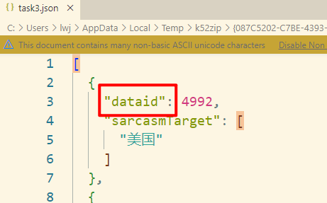
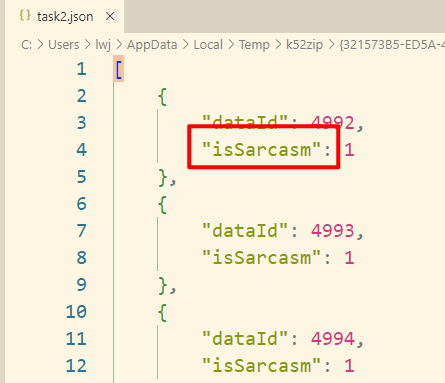
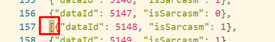

# 评测补充说明/提示

## 20240524_第一次补充/提示

1、请提交标准的JSON文件，提交的JSON文件中不需要出现“#任务几：XXX”字样。

2、每个JSON文件严格按照提供模板中的字段名命名。

3、提示：任务一的性能会影响任务二的结果。我们在计算任务二的F1时，会读取提交的 task1.json中isSarcasm＝0的dataId，并修改task2.json对应位置的sarcasmType为-1。

## 20240526_第二次补充/提示

1、 提交的文件中存在字段错误，比如：“dataId”写成"dataid" （注意驼峰命名），比如任务2的字段应该是“sarcasmType”写成了“isSarcasm”。

2、 存在队伍提交的json文件有格式错误，比如多了个中括号“[”。

3、 任务3由于需要存储中文，在json.dump时需要设置ensure_ascii为False。避免下图情况。

